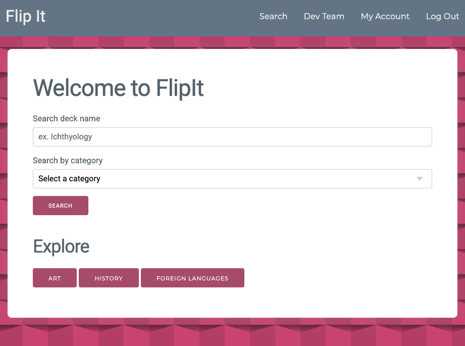

  # FlipIt
### Deployed link: https://flipitstudy.herokuapp.com/
  ## Project Creator: 
  ### Andrew, Derek, Hannibal, Mike
---
  
  ## Project Description:
  ### FlipIt is an interactive app where users can have the convenience of flashcards in their pocket! Just open the app and start studying.

  
---
 
  ## Table of Content
  1. [Installation](#Installation)
  2. [Usage](#Usage)
  3. [License](#License)
  4. [Contributing](#Contributing)
  5. [Links](#Links)
  6. [Tests](#Testing)
  7. [Email](#Contact)
  
  ---

  ## Installation:
  ## Developers please see the package.json file and then run NPM install on your command line.

  ---      

  ## Usage:

  * Starting on the home page anyone can use the search by deck bar or select a category from the drop. Alternatively anyone can just click search and look through all decks.
    * After running the search from the main page, you will see decks populate below. Now you may chose to study a deck of cards or view the deck of cards. 
    * If you select view, you will be taken to a screen that displays all cards within that specific deck, their questions and their answers. 
  
  * Users may create their own deck of study cards but only if they have an account. 
  * If the user does not have an account they will need to follow the Register link on the top right of the page and fill out the Create New Account form. 
  * Once the user has created an account they will need to log in. After logging in the new users dashboard will show no decks of study cards. 
    * You will need to click new deck, give that deck a name, and assign it to a category. Once the new deck is created, it will show up in the users dashboard. 
    * Now they will need to click view on the deck. From here you will need select add card, and then fill out the question and answer. 
    * Save your new cards and prepare to study. On the top right you will see a Study button, select study and test your knowledge. 
  * Once you are done studying you can click my account to go back to your dashboard, Search will bring you back to the homepage where you can see all other Decks created, and don't forget to stop by the Dev Team page to see who the masterminds of FlipIt are!

  ---
 
 ## Contributing:
 ## Please contact Derek or Andrew from the Dev Team page.
---

 ## Links

  * linkedIn: 
    * Andrew Bergstrom: https://www.linkedin.com/in/andrew-bergstrom-74a79aa4/ 
    * Derek Watson: https://www.linkedin.com/in/watsonderek/ 
    * Mike Shenk: https://www.linkedin.com/in/michaelshenk415/ 

        
  * Github:
    * FlipIt: https://github.com/AychDubya/Flipit
    * Andrew Bergstrom: https://github.com/AndrewBergstrom 
    * Derek Watson: https://github.com/derek-watson14 
    * Mike Shenk: https://github.com/mlshenk 
    * Hannibal Wyman: https://github.com/AychDubya  

  ---

  ## Contact
 
  ## If you have any questions, contact the author directly at: 
  ### Andrew.Bergstrom88@gmail.com 
  ### derek.watson92@gmail.com

---
### Back to the top:
  [FlipIt](#FlipIt)
### or check out the app: https://flipitstudy.herokuapp.com/
  
  

